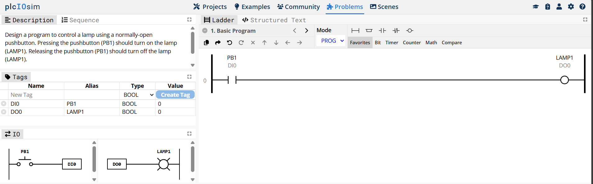

### 1. Basic Program

**Ladder Diagram**


**Code**

```text
IF PB1 THEN
    LAMP1 := TRUE;
ELSE
END_IF;

**Penjelasan**

Program pertama mengharuskan `PB1` mengontrol `LAMP1`. Saat `PB1` ditekan, `LAMP1` menyala, dan saat `PB1` dilepas, `LAMP1` mati.

Karena itu, `PB1` digunakan sebagai **Normally Open (NO)** untuk mengendalikan `LAMP1`.

### 2. Conveyor

**Ladder Diagram**



**Code**

```text

**Penjelasan**